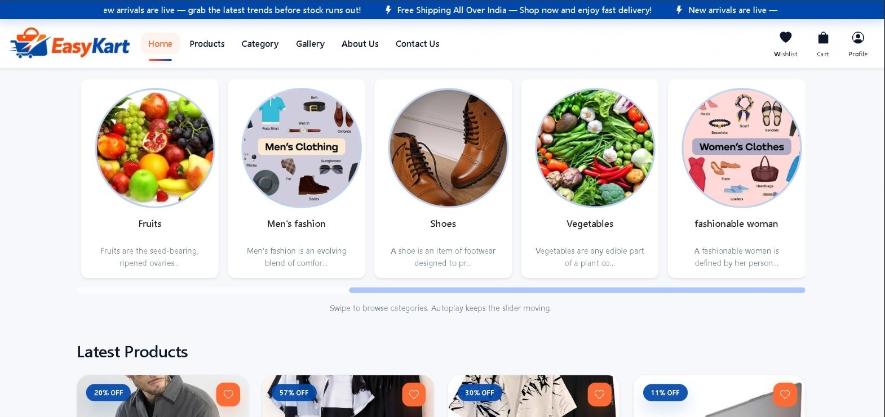

 

---

## 🧑‍💻 About Me

- 🎓 BCA Student
- 🌐 Aspiring Full Stack Developer
- 🐍 Currently working with Python & Django
- ☕ Learning Java and Data Structures
- 🗄️ Working with PostgreSQL & SQLite
- 🤖 Interested in AI & Machine Learning
- 🚀 Building practical projects to improve my development skills

## 🛠️ Technologies / 💻 Languages

  

## 🎨 Frontend

  

## ⚙️ Backend

  

## 🗄️ Database

  

## 🛠️ Tools

  

## 📌 Featured Projects

### 🛒 Easy Kart

<b> HOME </b>
/
<b> CATEGORY</b>
/
<b> PROFILE </b>

  
  
  

Django-based e-commerce platform featuring authentication, products, wishlist, cart, payments, orders and user profiles.

### 🚀 FastAPI CRUD

### 📦 Inventory Management
Django inventory management system for products, categories, stock, CRUD operations and database records.

### 🎓 Student Management
Django CRUD application for student registration, update, delete, search and database management.

## 🎯 Current Goals

- Master Python & Django
- Become a Full Stack Developer
- Improve Java & Data Structures
- Learn advanced database concepts
- Explore AI & Machine Learning
- Prepare for software development placements

### 🔥 Keep coding! 🧗‍♂️

**Code → Learn → Build → Improve → Repeat 🚀**

### 🚀 Thanks for visiting my profile!

⭐ If you like my projects, consider giving them a star!

